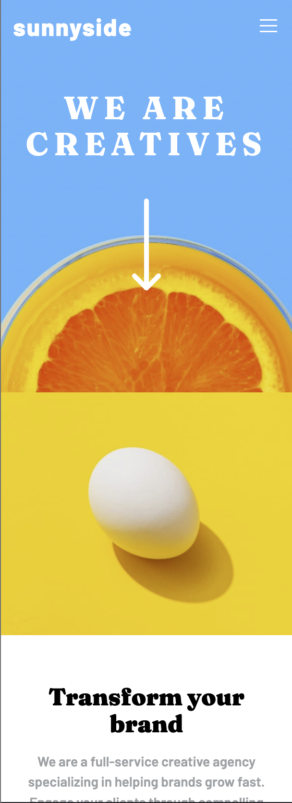
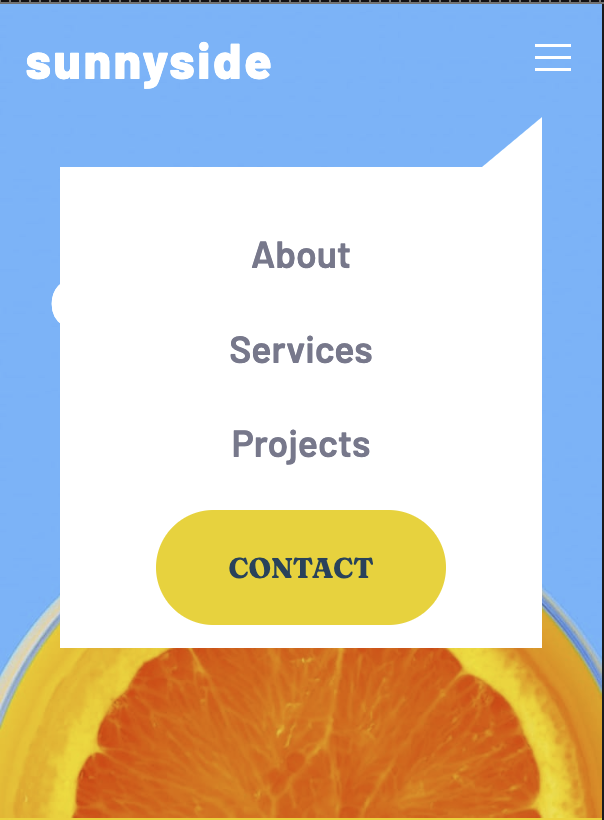
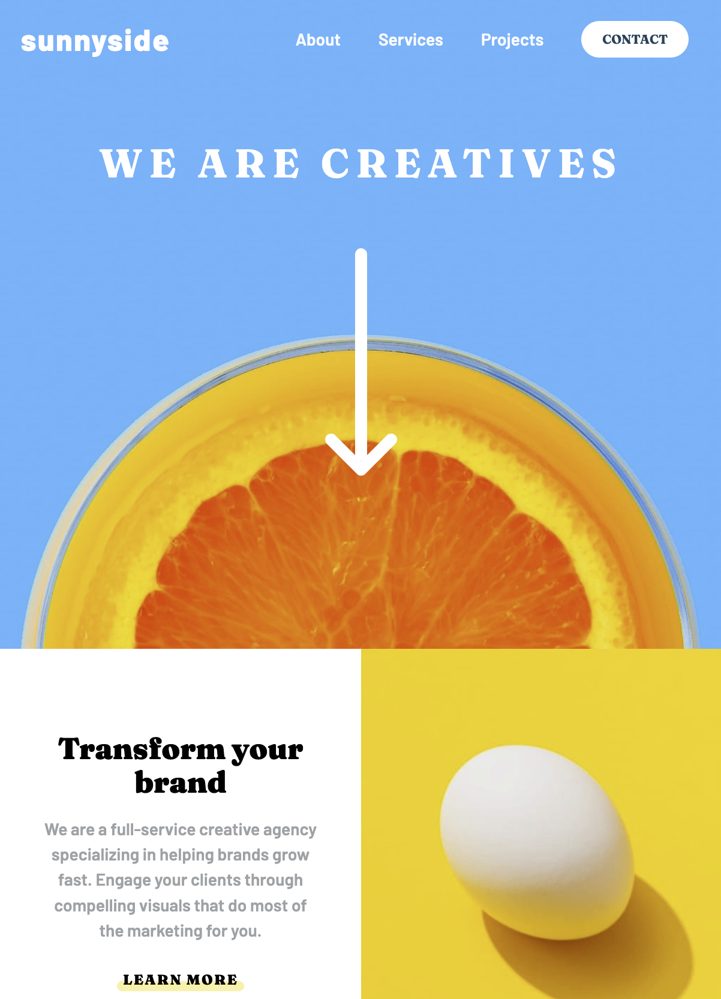

# Frontend Mentor - Sunnyside agency landing page solution

This is a solution to the [Sunnyside agency landing page challenge on Frontend Mentor](https://www.frontendmentor.io/challenges/sunnyside-agency-landing-page-7yVs3B6ef). Frontend Mentor challenges help you improve your coding skills by building realistic projects.

## Table of contents

- [Overview](#overview)
  - [The challenge](#the-challenge)
  - [Screenshot](#screenshot)
  - [Links](#links)
- [My process](#my-process)
  - [Built with](#built-with)
  - [What I learned](#what-i-learned)
  - [Continued development](#continued-development)
  - [Useful resources](#useful-resources)
- [Author](#author)
- [Acknowledgments](#acknowledgments)

## Overview

Landing page created with React, CUBE CSS and Sass

### The challenge

Users should be able to:

- View the optimal layout for the site depending on their device's screen size
- See hover states for all interactive elements on the page

### Screenshot

### Links

- Solution URL: [GitHub Page](https://mcdoodle1.github.io/sunnyside/)
- Live Site URL: [Sunnyside Landing Page](https://mcdoodle1.github.io/sunnyside/)

## My process

I started a React App with creact-react-app and divided the site into components: Menu for the navigation, Section for the cards in the main section, Testimonials, Gallery and Footer. I used Sass to compile my CSS so built several mixin's and variables. I also read Andy Bell's website about his CUBE CSS methodology and watch Youtube video's to get acquainted. I tried to use this methodology and divided my style sheets into Components, Utilities, Blocks and Exceptions.

### Built with

- CSS custom properties
- CSS Grid
- Flexbox
- Mobile-first workflow
- Responsive design
- [React](https://reactjs.org/) - JS library
- [CUBE CSS](https://cube.fyi) - CUBE CSS documentation
- [Sass](https://sass-lang.com) - Sass documentation

### What I learned

I improved my knowledge of CSS grid and responsive design. I tried to make the site responsive and fluid without using media queries. I built the site in React to improve my skills, but in retrospect the interactive elements in the site were too limited to take advantage of React's benefits. My first time to use Sass taught me how strong and diverse Sass is for compiling CSS. I learned the basics and plan to extend my knowledge. I liked CUBE CSS because it considers the cascading and specificity of CSS as its stength, but I did have difficulty implementing it. 

At the end I added the active states which presented a challenge to change the color of the social media icons when you hover over them. It was the first time I altered SVG-files.

### Continued development

Extend my knowledge of HTML, CSS and React. I plan to continue with Sass and will try to combine CUBE and BEM.

### Useful resources

- [CSS Tricks](https://www.youtube.com/watch?v=KE8MdPD9yac) - Youtube video about Andy Bell's CUBE CSS
- [CUBE CSS](https://cube.fyi/) - CUBE CSS documentation
- [CUBE CSS](https://andy-bell.co.uk/cube-css/) - Andy Bell's website about CUBE CSS
- [Sass](https://sass-lang.com) - Sass documentation
- [Smashing Magazine](https://www.smashingmagazine.com/2022/01/modern-fluid-typography-css-clamp/) - article about fluid typography
- [Aleksandr Hovhannisyan](https://www.aleksandrhovhannisyan.com/blog/fluid-type-scale-with-css-clamp/) - another article about fluid design
- [LogRocket](https://blog.logrocket.com/flexible-layouts-without-media-queries/) - flexible layouts without media queries
- [Create React App Dev](https://create-react-app.dev/docs/deployment/) - Manual to publish a React app on GitHub Pages
- [StackOverflow](https://stackoverflow.com/)
- [ChatDPT](https://chat.openai.com/)

## Author

- Website - [Marco Clarijs](https://github.com/MCDoodle1)
- Frontend Mentor - [@MCDoodle1](https://www.frontendmentor.io/profile/MCDoodle1)